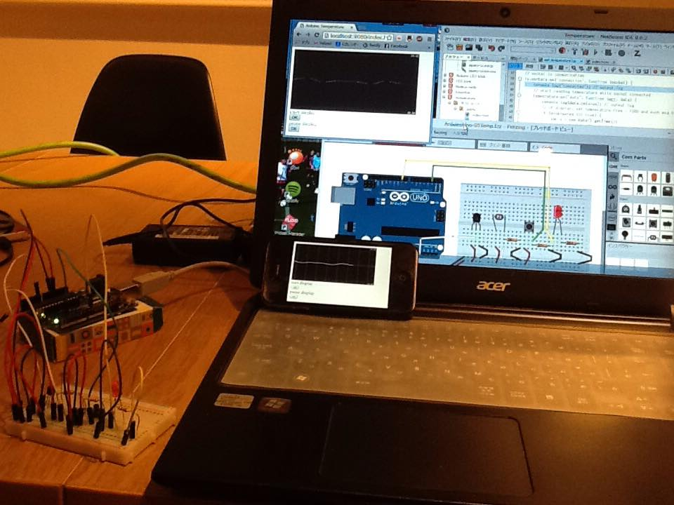

## Realtime animation of Arduino temperature on multiple browsers 
#### Jan.2015 Masuda.Michinori    

### 機能
* サーバに接続したArduino上の温度センサー（LM35DM）の値を読み取り、クライアント（ブラウザ）上に時系列アニメーションとして表示する。  
* ブラウザから、表示（正確にはサーバからの送信）のon/offを操作できる。  
* サーバに接続された複数のクライアント上で、同時に表示できる。
  
### 方式  
* サーバ側：node.jsプラットフォーム、Arduino上の温度センサーからの読み取りはFirmata上で[johnny-five](https://github.com/rwaldron/johnny-five)を使用。
* クライアント側：ブラウザでのアニメーション表示は[Smoothie Charts](http://smoothiecharts.org/)を使用。
* クライアント/サーバ間通信：HTML/Javascriptの読み取りにhttpを用いた後、温度データと制御のやりとりはsocket.ioを用いる。
* [Smoothie Charts](http://smoothiecharts.org/),[johnny-five](https://github.com/rwaldron/johnny-five)の著作権の扱いについては、それぞれのコードを参照の事。
  
### ファイル構成と配置  
* サーバ側：node.js実行場所に、/get_temperature.js
* クライアント側：node.js実行場所/public/に、index.html　と　smoothie_mm.js
  
### 操作、及び、オプション
* サーバ側：$node get_temperature.jsを起動、クライアントはサーバの初期化完了後に起動の事。初期化はコンソールで確認できる。
* クライアント側：localhost:8080（同一PCで実行時）
,  http://ip_address:8080/index.html（ネットワーク経由の場合）
* クライアントでのy軸表示範囲をsmoothie_mm.jsの495-6行で設定（最大25度、最小15度）
  
### 動作確認環境
* サーバ側：windows8.1, node.js v0.10.35, express 4.10.7, socket.io 1.2.1
* Arduino：Arduino Uno R3, IDE 1.0.6. johmmy-five 0.8.37
* クライアント側:chrome/windows8.1 40.0.2214.91,Safari/iOS 8.1.2

### Known issues
* get_temperature.jsにおいて、socket.broadcast.emitだけでは、ブラウザからindex.htmlを2度読み込まないと、ブラウザがデータ受信されない。この回避のために、socket.emitを追加している。（原因不明）  
* smoothie_mm.jsにおいて、y軸表示範囲を495-6行に直値で設定している。この範囲を超えても自動的に表示範囲を拡大するが、一旦拡大後に初期値を下回ると、表示範囲は初期を下回る。（直値でない設定方法も含めて今後の課題）
